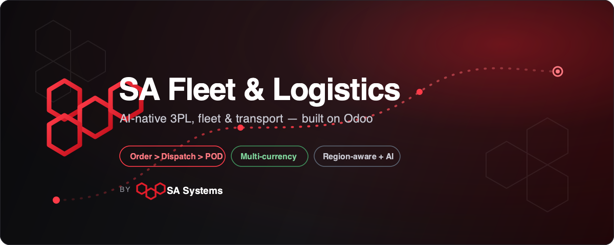

# SA Fleet &amp; Logistics — Odoo 18 / 19

> AI-native **3PL, fleet and transport management** for Odoo, by **SA Systems**.
> Multi-currency as standard, region-aware for a worldwide rollout, and built
> entirely on standard Odoo apps.



## What this is

A complete, country-agnostic transport and logistics operating system for Odoo,
delivered as one umbrella app (`sa_fleet_logistics`) that bundles **16
integrated modules** covering the entire chain — from order capture to cash:

**Order → AI plan → Dispatch → In Transit → Proof of Delivery → Billing → Settlement.**

- **Operations** — transport orders, fleet & drivers, dispatch & trips, route
  optimization, live GPS & geofencing, proof of delivery, warehouse / cross-dock
  and preventive maintenance.
- **Commerce** — customer rate cards & billing that post to invoices, plus
  carrier and driver settlement.
- **Intelligence** — AI ETA, delay risk and price suggestions through a
  pluggable provider layer (offline heuristic by default; OpenAI / Azure
  optional), with a natural-language assistant.
- **Global** — multi-currency on every monetary value and region profiles for
  units, currency, language, timezone, compliance and tax regimes.
- **Advanced & integration** — hazmat, cold-chain, customs, CO₂, detention,
  insurance, a public tracking portal, EDI (X12 204/214/210/990) and
  HMAC-signed webhooks.

## Compatibility

- Odoo **18.0** and **19.0** (Community & Enterprise) — one codebase, both
  series.
- License: **LGPL-3**.

## Quick start (Docker)

```bash
cp odoo.conf.example odoo.conf      # then edit the CHANGE_ME values
./start-test.sh up                  # boots Postgres + Odoo and installs the app
./start-test.sh logs                # watch until you see "Modules loaded."
```

Open http://localhost:8069 and log in with `admin` / `admin`.

| Command | Action |
| --- | --- |
| `./start-test.sh up` | Start Postgres + Odoo and install the platform |
| `./start-test.sh logs` | Tail the Odoo logs |
| `./start-test.sh update` | Apply code changes (`-u sa_fleet_logistics`) |
| `./start-test.sh test` | Run the unit tests on a fresh DB |
| `./start-test.sh stop` | Stop the containers |
| `./start-test.sh reset` | **Delete** the database and files |

## Manual install

Copy the repository folders into a path on your Odoo `--addons-path`, then:

```bash
./odoo-bin -c odoo.conf -d fleet_db -i sa_fleet_logistics --stop-after-init
```

Or from the UI: **Apps → Update Apps List → search "SA Fleet & Logistics" →
Install** (installs all 16 modules).

## Repository layout

```
.
├── sa_fleet_logistics/      # umbrella app (install this)
├── odotrans_base/           # platform core
├── odotrans_tms/            # menus, settings, shared models
├── odotrans_fleet/          # vehicles, trailers, drivers
├── odotrans_dispatch/       # trips, manifests, dispatch board
├── odotrans_route/          # route optimization
├── odotrans_gps/            # live tracking & geofencing
├── odotrans_pod/            # proof of delivery
├── odotrans_driver_api/     # JSON driver API
├── odotrans_warehouse/      # docks & cross-dock
├── odotrans_billing/        # rate cards & customer billing
├── odotrans_settlement/     # carrier & driver settlement
├── odotrans_maintenance/    # preventive maintenance
├── odotrans_ai/             # AI ETA, price & assistant
├── odotrans_region/         # region profiles
├── odotrans_advanced/       # hazmat, cold-chain, customs, portal
├── odotrans_integration/    # EDI, webhooks, connectors
├── docker-compose.yml
├── odoo.conf.example
└── start-test.sh
```

## License

LGPL-3. See [LICENSE](LICENSE).

---

**SA Systems** · [info@sasystems.solutions](mailto:info@sasystems.solutions) ·
<https://sasystems.solutions>
